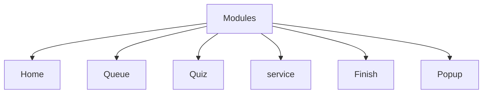

# Exam App Project
demo https://ftohtarek.github.io/Web-API/Exams-Application/
## Overview
- application traning in web api and oop in js 
- consitst from 3 page not navigate just hide and show this page 
- bulid each functionlaty as seperate unit 
- use Queue DataSturcture in several place

- ## project Flow Digram

